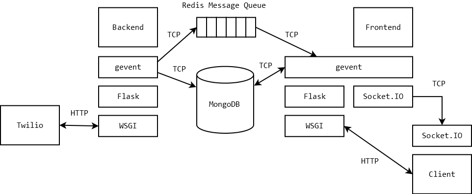

# TEDxHEC Montreal 2013

This project contains the technology powering the TEDxHEC Montreal talk given by Rami Sayar (GitHub: [@sayar](http://github.com/sayar), Twitter: [@ramisayar](http://twitter.com/ramisayar)). The purpose of the technology was to demonstrate the principle of democratic collaboration with constraints. The technology was used to collaboratively build a story live with the audience.

The system harnesses a variety of web services and technologies, including Twilio cloud communication services, NoSQL databases and scalable message queues, to allow users to collaborate on a story by sending an SMS to a specific phone number. These messages are streamed in real-time to any browser connected to the web application. A major goal of this project is to explore the impact of distributed software architectures on real-time performance and scalability. Hence, the system is designed around two loosely coupled components: the backend and the frontend. This README also describes our approach to testing and deployment.

## Contributors

* Project Lead: Rami Sayar ([@sayar](http://github.com/sayar))
* Alex Carruthers ([@alexcarruthers](http://github.com/alexcarruthers))
* Kelley Mitchell ([@KelleyM14](http://github.com/KelleyM14))

## Design and Architecture
### Design Decisions

The architecture of the system is illustrated in Figure 1. The backend is responsible for receiving SMSes from Twilio, saving them in the database, and pushing them through the message queue towards the frontend. The frontend consists of a streaming server for pushing SMSes to the client in real-time, as well as a web server for static resources, namely HTML, CSS and JavaScript files. Third-party libraries are hosted on Content Delivery Networks (CDNs). The streaming server listens to a message queue to forward any incoming SMS from the backend to all connected clients. Upon receiving a new client connection, the streaming server connects to the database and sends all SMSes (previously stored by the backend) to the client, sorted by date. The system was implemented using the Python programming language, the gevent concurrent networking library, the Socket.IO real-time communication library, the Flask web framework, the MongoDB database, and the Redis data store. 


The architecture of both the backend and frontend servers is based on the reactor design pattern [1], which is implemented using asynchronous event notification coupled with green threads. This approach was selected over multithreading, since spawning a kernel thread for every incoming connection is inefficient due to the expensive overhead of context switches and the high memory consumption associated with maintaining numerous kernel stacks. Likewise, servers attempting to solve these problems using thread pools are still vulnerable to resource exhaustion, as demonstrated by the Slowloris denial-of-service attack [2]. In fact, modern web servers like nginx favour the asynchronous event-driven model over multithreading [3]. Moreover, mutual exclusion is not needed in our design, since the cooperative scheduling ensures that execution is not pre-empted between socket operations. In other words, the green thread will never be interrupted during database or message queue communication, so data corruption is impossible. 

The decision to utilize a reactor design pattern was further motivated by the expected usage of the application during the TEDx talk. The speaker will be asking over 300 people to send an SMS at once. Thus, a high traffic load is expected in a very short amount of time. Attempting to use a multithreading approach to handle the traffic would require at least 300 threads to be ready at all times or a large number of multithreaded servers with a load balancer in front – both situations would be monetarily costly in terms of server resources. Without reserving threads to handle the traffic, the system would be unable to respond in a reasonable amount of time (under 1 second). Servers using the reactor design pattern with asynchronous event notification do not suffer from expensive kernel thread spawning and the overhead of context switches while maintaining similar performance characteristics.

The design employs the gevent library instead of multiple threads for the aforementioned performance reasons. Gevent is a coroutine-based Python networking library that uses the libevent library as its asynchronous event notification mechanism. [4] Gevent uses a lightweight execution unit called green thread in opposition to kernel threads. The use of green threads through the use of the greenlet library allows gevent to expose a synchronous application programming interface. This stands in contrast with other Python libraries using an asynchronous event notification mechanism such as Tornado.  Tornado is a Python web framework and asynchronous networking library [5] that offers the same performance benefits as gevent. However, Tornado uses a callback mechanism for handling responses to network operations which are harder to use for the programmer, thus the decision was to use Gevent.

In initial iterations of the project, the frontend server and the JavaScript client would communicate via raw WebSockets, but this approach was dropped in favour of the Socket.IO library. This design decision was motivated by the wider client-side support, since Socket.IO can fallback to other transports (e.g. Flash sockets, AJAX long polling) if WebSockets are not supported by the browser [6]. Furthermore, Socket.IO abstracted common networking patterns such as publish-subscribe channels. Using the publish-subscribe channel implementation in Socket.IO allowed is to avoid reinventing the wheel as would have been required with using raw WebSockets.

The Flask framework was chosen for its minimalism and ease-of-use. Flask offers straightforward URL routing facilities and standard processing of POST requests received. A complex web framework is not required as most of the communication will be taking place outside the HTTP protocol and with WebSockets. Flask was used for handling the GET and POST requests from the browser and from Twilio. Furthermore, Flask is also used to serve static resources that are not hosted on a CDN.  

To persist all messages and to rebuild a story from the first message requires the use of a database. Due to the high traffic load expected in a short amount of time, insertion speed into a database is much more important than querying capability. As a result, typical databases may not be able to support the high insertion traffic due to the transactional framework most SQL databases use to guarantee data integrity and consistency. None the less, NoSQL options designed to handle high traffic loads in memory and persist them at a slower rate than insertion are available. Among these choices, there is Couchdb, Mongodb, Cassandra and HBase. The MongoDB database was selected for its high insertion speed compared with MySQL, ease-of-installation, simple querying language and the convenience of a NoSQL persistent storage. [7]
The Redis in-memory data store was used as a message queue following the publish-subscribe architectural pattern. In this model, multiple subscribers (frontend) listen to incoming messages from a queue populated by the publisher (backend) [8]. In this way, the system is loosely coupled and scalability can be easily achieved by distributing the frontend server over multiple machines. Early versions of the systems employed ZeroMQ for message passing, but it was later replaced by Redis for ease of deployment.

### Backend

Upon program initialization, the backend server establishes connections to the MongoDB database and the Redis message queue. After parsing command-line arguments for debug logging as well as host and port configuration, the program constructs a WSGI server whose request handler is the Flask application. Whenever a user sends an SMS to the registered phone number, Twilio creates a POST request directed at the /input URL of the backend server. Flask routes this request to the sms function, which extracts the fields of the submitted HTML form, namely the SMS SID, the body text, as well as the phone number, city, ZIP code, state and country of the sender. It inserts this data into the MongoDB database, along with a timestamp. Finally, it publishes the body text to the Redis message queue and sends an empty response back to Twilio.

### Frontend

Upon program initialization, the frontend server connects to the MongoDB database and the Redis message queue. After parsing command-line arguments for host and port configuration, the program starts a SocketIOServer, whose request handler is the Flask application. The Flask application is responsible for serving static resources in the static directory, rendering index.html whenever it receives a request for the / path, and forward to the Socket.IO handler whenever it receives a request on the /socket.io/ path. This last routing is necessary since the client-side Socket.IO library creates requests destined to URLs with that prefix. The SMSNamespace class is the handler for Socket.IO requests sent to /socket.io/sms. 

The JavaScript client uses the jQuery DOM scripting library, the D3 visualization library, and the Socket.IO real-time networking library, which are hosted on the Google and Cloudflare CDNs. The client-side Socket.IO connection is hooked up to the /sms URL and configured to respond to sms events. Upon receipt of a sms event, the sentence is spliced into the story at the specified position. Visualization is accomplished using the D3 library. Sentences are displayed as manually word-wrapped SVG text elements with a random color. A fading and sliding effect animates newly inserted sentences.

### Scaling

The traffic load generated during the TEDx talk is expected to be of a huge amount and of short duration. The system has to handle traffic bursts and offer a quick response time lest the talk be stalled. Scaling issues were thus taken into high consideration during the design of the project and deserve a separate discussion. The technologies used offer scaling methods to handle greater traffic loads through replication or load-balancing. 

The backend system uses a standard HTTP web stack with an asynchronous event notification mechanism. The gevent network and concurrency offers the ability to handle many requests simultaneously without the overhead of kernel thread creation and context switching. However, this may not prove to be sufficient. The backend does not do any complex processing, it simply inserts the document into Mongodb, publishes to a queue and returns a 200 OK response to Twilio. Thus, the backend service can be replicated without any complication or synchronization issues. The strategy taken to scale the backend is simply to run the gevent server on a single thread per core and to use Nginx or HAProxy as a load-balancer between each instance. Furthermore, several additional machines can be used to run several backend servers with a load-balancer service requests to each machine. This strategy is expected to reasonably handle additional load and has the added benefit that new machines can be added to the load-balancer to handle additional load without any system downtime. 

The Redis in-memory data store used for the publish-subscribe infrastructure can be scaled to handle a greater load using a master-slave configuration where the master message queue is replicated to the slave queues. [9]
The mongodb database used to persist the messages can be scaled out using a sharding cluster. Sharding partitions a collection and allows you to automatically distribute data to multiple serves. [10] Sharding provides additional write capacity and thus increases the insertion rate helping the system handle greater traffic loads in a short period of time.

The approach to scaling the front-end is the same as for the backend. However, the front-end scaling is interesting because WebSockets do not have the same ecosystem maturity as regular HTTP traffic. Typically, load balancing WebSocket traffic with traditional means breaks one-to-one connection between a browser and the server handling the traffic. A L3 load-balancer that distributes IP packets based on source-ip-hash routing would work and consistently route the IP traffic to the same server hosting the WebSocket server. This would complicate deployment of the system and require custom hardware to be installed. The other option is to customize HAProxy to be able to switch a connection from HTTP to TCP without breaking it when the WebSocket protocol negotiates a connection-upgrade. The second option is viable and possible with a custom configuration file for HAProxy. It is important to note that load balancing the WebSocket traffic may turn to be unnecessary as few people will be able to access the site during the presentation. Load balancing the HTTP part of the front-end is trivial and exactly the same as the backend.

### Deployment

The project was deployed on Amazon Web Services. The backend ran on separate two EC2 instances with High-CPU Medium profiles which provide 1.7 GiB of Memory, 5 EC2 Compute Units. [11] Two EC2 instances of this size can provide for up to 10 threads total running gevent with 1 additional thread per machine running nginx as a HTTP proxy. The incoming traffic will be load balanced behind Amazon ELB to each EC2 instance. [12] 

The Redis service ran on a single High-CPU Medium profile. Redis is simply used as a publish-subscribe service, the queue will not be persisted or stored in-memory for a long time. The key requirement for this service is to move messages as quickly as possible and thus a High-CPU profile is required. 

The mongodb service can be hosted on MongoHQ, a scalable mongo hosting infrastructure as a service provider. This provides a cheaper alternative to deployment to a custom EC2 instance and provide greater scalability.

The front-end ran on separate two EC2 instances with High-CPU Medium profiles which provide 1.7 GiB of Memory, 5 EC2 Compute Units. Two EC2 instances of this size can provide for up to 10 threads total running gevent with 1 additional thread per machine running HAProxy as a HTTP and WebSocket proxy. The incoming traffic was load balanced behind a third EC2 instance which only runs HAProxy. Currently, Amazon Elastic Load Balancer does not balance WebSocket traffic correctly.

### Testing

Testing the backend is fairly straight forward and we rely on unit-tests to verify whether information POSTed from Twilio is properly stored in the database. It is important to note that during testing the system is able to accept POST requests from any domain or source-IP. This will not be true on the deployed version where only servers owned by Twilio are whitelisted. All other server requests will be rejected. Testing the front-end is much more difficult as few testing tools exist for WebSockets due to the immaturity of the technology. The testing was mostly conducted programmatically by sending ordered messages and verifying that they displayed correctly on the Browser, unfortunately, unit-tests cannot be used for this part. Standard load-testing tools such as Apache ab, a HTTP server benchmarking too, was used for testing overall system capacity. [13] The mechanize project was also used to test the system with custom POST requests. 

### References

[1]	D. C. Schmidt. (1998, November 19). Reactor: An Object Behavioral Pattern for Demultiplexing and Dispatching Handles for Synchronous Events [Online]. Available: http://www.dre.vanderbilt.edu/~schmidt/PDF/reactor-siemens.pdf

[2]	R. Hansen. (2009, June 17). Slowloris HTTP DoS [Online]. Available: http://ha.ckers.org/slowloris

[3]	I. Sysoev. (2013, March 5). Nginx: Connection Processing Methods [Online]. Available: http://nginx.org/en/docs/events.html

[4]	D. Bilenko. (2013). Gevent: A coroutine-based network library for Python [Online]. Available: http://www.gevent.org/

[5]	B. Darnell. (2013) Tornado Web Server. [Online] Available: http://www.tornadoweb.org/en/stable/

[6]	G. Rauch. (2012). Socket.IO: Supported Transports [Online]. Available: http://socket.io/#browser-support

[7]	T. Nguyen. (2012, August 24). MySQL and MongoDB Performance Benchmarking (Part 2). [Online]. Available: http://nguyencs.com/2012/08/24/mysql-and-mongodb-performance-benchmarking-part-2/

[8]	S. Sanfilippo. (2013). Redis: Pub/Sub [Online]. Available: http://redis.io/topics/pubsub

[9]	Redis Group. (2013). Redis: Replication [Online]. Available: http://redis.io/topics/replication

[10]	10Gen. (2013). Sharded Cluster Overview [Online]. Available: http://docs.mongodb.org/manual/core/sharded-clusters/

[11]	Amazon. (2013). Amazon Elastic Compute Cloud [Online]. Available: http://aws.amazon.com/ec2/

[12]	Amazon. (2013). Elastic Load Balancing [Online]. Available: http://aws.amazon.com/elasticloadbalancing/

[13]	Apache Group. (2013). ab - Apache HTTP server benchmarking tool [Online]. Available: http://httpd.apache.org/docs/2.2/programs/ab.html
